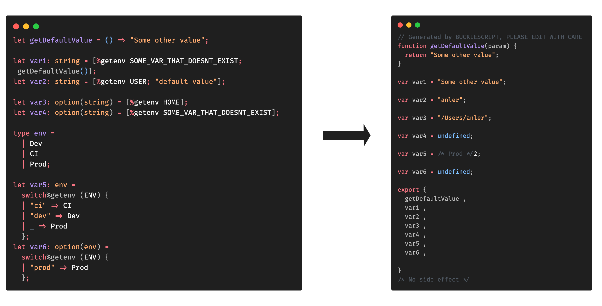

# bs-getenv

 [](https://www.npmjs.com/package/bs-getenv)

PPX for [ReasonML](https://reasonml.github.io) / [BuckleScript](https://bucklescript.github.io) for embedding
environment variables in the code.



## Installation

Get the package:

```shell
# yarn
yarn add bs-getenv
# or npm
npm install --save bs-getenv
```

Then add it to `bsconfig.json`:

```json
"ppx-flags": ["bs-getenv/ppx"]
```

## Usage

### `%getenv ...`

#### With a default value

Usage: `[%getenv VAR_NAME; defaultValue]`, where:

- The result type will be `string`
- `defaultValue` can be any expression of type `string`

#### Without a default value

Usage: `[%getenv VAR_NAME]`, where:

- The result type will be `option(string)`.

### `%getenv.exn ...`

Usage: `[%getenv.exn VAR_NAME]`, where:

- The result type will be `string`
- Useful in those cases where the application absolutely needs an env variable to exist (e.g.: app secrets)
- If `VAR_NAME` env var does not exist, it will fail **at compile time** with the message: `%getenv environment variable not found: VAR_NAME`

### `switch%getenv ...`

#### With a default value (exhaustive pattern matching)

Usage:

```reason
switch%getenv (VAR_NAME) {
| "<some value>" => ...
| _ => ...default
}
```

where:

- The result type will be the type of the cases

#### Without a default value (non-exhaustive pattern matching)

Usage:

```reason
switch%getenv (VAR_NAME) {
| "<some value>" => ...
}
```

where:

- The result type will be `option(t)` where `t` is the type of the cases

## Example

```reason
let getDefaultValue = () => "Some other value";

let var1: string = [%getenv SOME_VAR_THAT_DOESNT_EXIST; getDefaultValue()];

let var2: string = [%getenv USER; "default value"];

let var3: option(string) = [%getenv HOME];

let var4: option(string) = [%getenv SOME_VAR_THAT_DOESNT_EXIST];

let var5: bool =
  switch%getenv (USER) {
  | "anler" => true
  | _ => false
  };

let var6: option(bool) =
  switch%getenv (USER) {
  | "anler" => true
  };
```

## Developing

Clone repo and install deps:

```shell
esy install
yarn install
```

Build ppx:

```shell
esy build
```

To explore generated output, run `yarn build` and look the compiled file `test/Test.bs.js`.

## TODO

- [x] Just get env variables
- [x] Support switch cases
- [x] Better error reporting
- [ ] Support switch guards and variables
